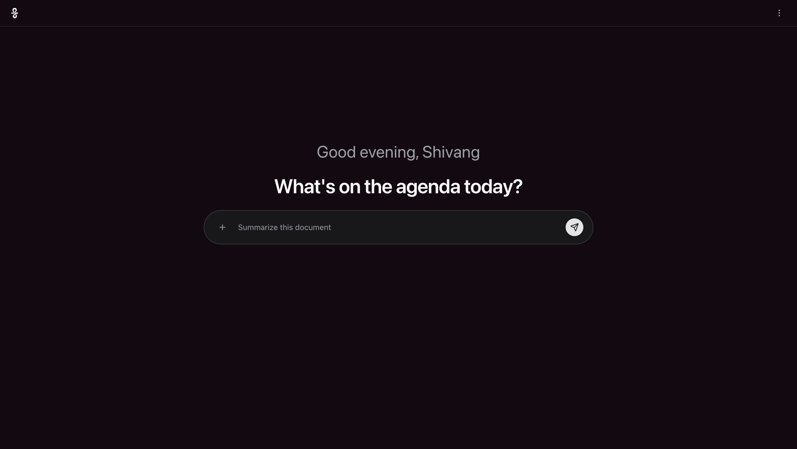
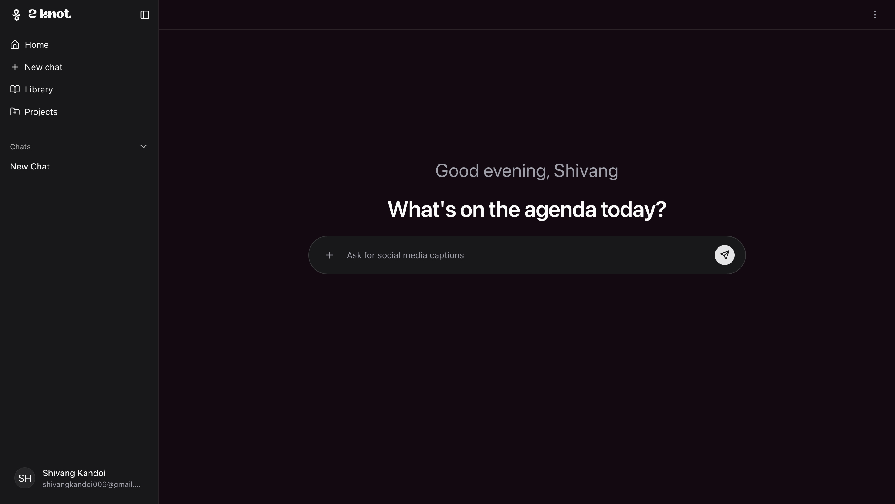
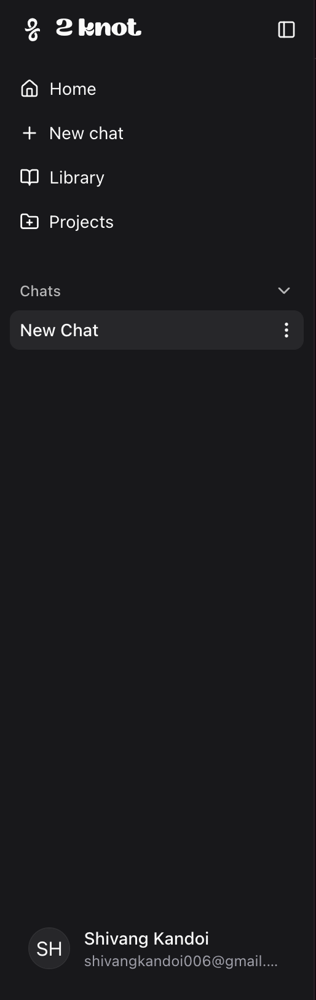
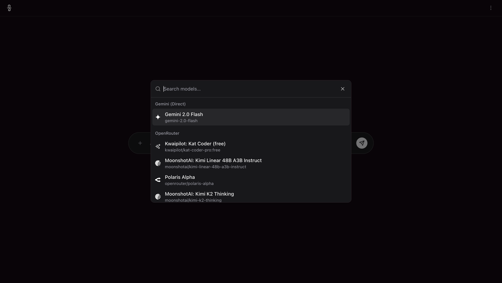
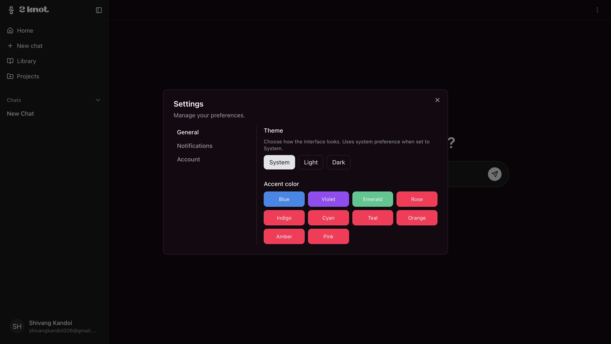

<div align="center">

# Quild AI

Clean, fast, and secure AI chat backend + frontend. Streamed AI answers, optional web-augmented responses, and persistent chat history.

</div>

## UI Preview

<div align="center">

<table>
  <tr>
    <td align="center">
      
      <div><b>Auth</b></div>
    </td>
    <td align="center">
      
      <div><b>Main App (1)</b></div>
    </td>
    <td align="center">
      
      <div><b>Main App (2)</b></div>
    </td>
  </tr>
  <tr>
    <td align="center">
      
      <div><b>Sidebar</b></div>
    </td>
    <td align="center">
      
      <div><b>Model Selector</b></div>
    </td>
    <td align="center">
      
      <div><b>Settings</b></div>
    </td>
  </tr>
</table>

</div>

## Why this project

- Build production-ready AI chat with security, speed, and clean architecture.
- Stream responses in real time and optionally ground them with fresh web results.
- Keep conversations and messages persisted for continuity and auditability.

## Quick start

1) Set environment variables (see Docs → Technical Stack → Env Vars)
2) Install deps in each app (root/frontend/backend)
3) Run backend and frontend in dev mode

```bash
# backend
npm install --prefix backend
npm run dev --prefix backend

# frontend
npm install --prefix frontend
npm run dev --prefix frontend
```

## Documentation (start here)

Everything you need is one click away:

- 01 — Overview → [docs/01-Overview.md](docs/01-Overview.md)
- 02 — Technical Stack → [docs/02-Technical-Stack.md](docs/02-Technical-Stack.md)
- 03 — Data Model → [docs/03-Data-Model.md](docs/03-Data-Model.md)
- 04 — API Routes → [docs/04-API-Routes.md](docs/04-API-Routes.md)
- 05 — Core Logic → [docs/05-Core-Logic.md](docs/05-Core-Logic.md)
- 06 — File Breakdown → [docs/06-File-Breakdown.md](docs/06-File-Breakdown.md)

## Architecture at a glance

- Frontend ↔ Backend ↔ External Services ↔ MongoDB
- Backend: Express + TypeScript, JWT auth (access/refresh), SSE streaming.
- AI Providers: Gemini (default) or OpenRouter via OpenAI-compatible client.
- Web augmentation: SerpAPI (Google/News Light) with safe content extraction.

## Features

- Auth: register, login, refresh, logout, current user.
- Conversations: list, create, delete, rename.
- Messages: paginated retrieval per conversation.
- AI streaming: Server-Sent Events with status phases and source pills.
- RAG-lite: multi-query planning, dedupe, optional article text extraction.

## Tech stack

- Node.js, TypeScript, Express, Mongoose (MongoDB)
- JWT (jsonwebtoken), bcryptjs, helmet, cors, rate limiting, morgan
- ai, @ai-sdk/openai, @ai-sdk/google, SerpAPI integration

## Environment

See docs/02-Technical-Stack.md for full list and explanations. Required highlights:

- MONGODB_URI
- JWT_ACCESS_SECRET, JWT_REFRESH_SECRET
- CLIENT_ORIGIN
- GEMINI_API_KEY
- Optional: SERPAPI_KEY, OPENROUTER_API_KEY (+ model/referer/title)

## Scripts

```bash
# backend
npm run dev --prefix backend     # ts-node-dev
npm run build --prefix backend   # tsc build
npm run start --prefix backend   # run dist
```

## Contributing

- Read the docs above, follow the API contracts, and keep types tight.
- When adding routes or data, update: 03-Data-Model, 04-API-Routes, 06-File-Breakdown.

— Happy shipping!
